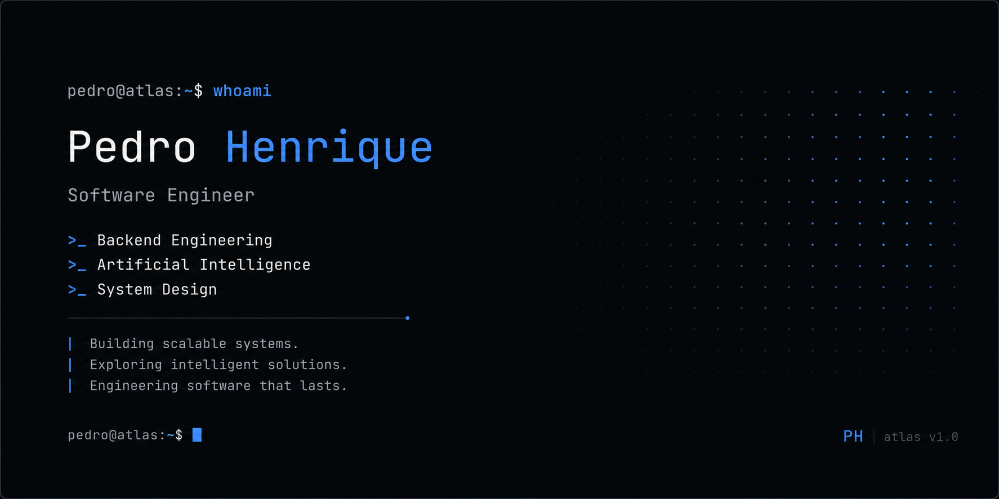

<p align="center">
  
</p>

<div align="center">

### Software Engineer

**Backend • Artificial Intelligence • System Design**

Building scalable systems. Exploring intelligent software. Engineering in progress.

<br/>

[`📂 About`](#about) &nbsp;·&nbsp; [`🎯 Focus`](#focus) &nbsp;·&nbsp; [`🛠️
Stack`](#stack) &nbsp;·&nbsp; [`🚀 Projects`](#projects) &nbsp;·&nbsp; [`📝
Notes`](#notes) &nbsp;·&nbsp; [`🗺️ Roadmap`](#roadmap) &nbsp;·&nbsp; [`📞
Contact`](#contact)

 </div>

 <br/>

 ---

 <br/>

 <table>
 <tr>
 <td width="55%" valign="top">

 <h2 id="about">atlas/about</h2>

 ```bash
 pedro@atlas:~$ curl -s https://api.github.com/users/phsouzaro
 {
   "name": "Pedro Henrique",
   "location": "Brazil 🇧🇷",
   "role": "Software Engineer",
   "specialties": ["Backend", "AI", "System Design"],
   "focus": "Java & Spring Boot ecosystem"
 }
 ```

 I'm a Software Engineer from Brazil 🇧🇷, currently building high-performance backend
systems with **Java** and **Spring Boot**.

 I am driven by deep curiosity and a passion for understanding how complex software
works internally.

 Every repository here is a building block in my long-term engineering journey.

 </td>

 <td width="45%" valign="top">

 <h2 id="focus">atlas/focus</h2>

 ```bash
 pedro@atlas:~$ ls -la ~/focus
 total 24
 drwxr-xr-x  pedro  staff   system-design/
 drwxr-xr-x  pedro  staff   artificial-intelligence/
 drwxr-xr-x  pedro  staff   distributed-systems/
 drwxr-xr-x  pedro  staff   software-architecture/
 drwxr-xr-x  pedro  staff   cloud-infrastructure/
 drwxr-xr-x  pedro  staff   production-backend/
 ```

 </td>
 </tr>
 </table>

 <br/>

 ---

 <br/>

 <h2 id="stack">atlas/stack</h2>

 ```bash
 pedro@atlas:~$ atlas --stack
 ┌─────────────────┬────────────────────────────────────────────────────┐
 │ CATEGORY        │ TECHNOLOGIES & TOOLS                               │
 ├─────────────────┼────────────────────────────────────────────────────┤
 │ Core & Backend  │ Java (17/21) • Spring Boot • Spring Security       │
 │ Integrations    │ Spring Data JPA • Hibernate • Apache Camel • REST  │
 │ Databases       │ PostgreSQL • MySQL • Relational Design • Tuning    │
 │ Infrastructure  │ Docker • Git • Linux • AWS • Kubernetes            │
 │ Exploring AI    │ LLMs • RAG (Retrieval) • AI Agents • VectorDBs     │
 └─────────────────┴────────────────────────────────────────────────────┘
 ```

 <br/>

 ---

 <br/>

 <h2 id="projects">atlas/projects</h2>

 <table>
 <tr>
 <td width="50%" valign="top">

 ### 🧪 [backend-labs](https://github.com/Phsouzaro/backend-labs)
 > Production-ready backend applications built with Java & Spring Boot.

 - 🎯 **Focus:** Secure REST APIs, OAuth2, Database migrations, Unit/Integration tests,
Clean Architecture.
 - 🛠️ **Stack:** `Java` `Spring Boot` `Spring Security` `PostgreSQL` `Docker`
 - 📈 **Status:** _Under active development_

 </td>

 <td width="50%" valign="top">

 ### 🤖 [ai-lab](https://github.com/Phsouzaro/ai-lab)
 > Hands-on engineering with Artificial Intelligence and LLMs.

 - 🎯 **Focus:** Practical AI agent orchestration, Retrieval-Augmented Generation (RAG),
and vector embeddings.
 - 🛠️ **Stack:** `Python` `LangChain` `VectorDB` `LLMs` `RAG`
 - 📈 **Status:** _Under active development_

 </td>
 </tr>

 <tr>
 <td width="50%" valign="top">

 ### 🏛️ [system-design-lab](https://github.com/Phsouzaro/system-design-lab)
 > Architectural studies, scalability, and distributed patterns.

 - 🎯 **Focus:** High-availability architectures, messaging trade-offs, caching
patterns, and visual diagrams.
 - 🛠️ **Stack:** `Distributed Systems` `System Design` `Software Architecture`
 - 📈 **Status:** _Under active development_

 </td>

 <td width="50%" valign="top">

 ### 📝 [engineering-notes](https://github.com/Phsouzaro/engineering-notes)
 > A curated, public knowledge base of computer science & engineering.

 - 🎯 **Focus:** Structured study notes, deep dives, patterns, and long-term tech stack
insights.
 - 🛠️ **Stack:** `Markdown` `Obsidian` `Architecture Notes`
 - 📈 **Status:** _Under active development_

 </td>
 </tr>
 </table>

 <br/>

 ---

 <br/>

 <h2 id="notes">atlas/notes</h2>

 ```bash
 pedro@atlas:~$ tree ~/engineering-notes --dirsfirst
 engineering-notes/
 ├── 🤖 artificial-intelligence/
 ├── ⚙️ backend-engineering/
 ├── 🧼 clean-code/
 ├── ☁️ cloud/
 ├── 🗄️ databases/
 ├── 🌐 distributed-systems/
 ├── 🏛️ software-architecture/
 └── 📐 system-design/

 8 directories, 0 files
 ```

 <br/>

 ---

 <br/>

 <h2 id="roadmap">atlas/roadmap</h2>

 ```bash
 pedro@atlas:~$ atlas --roadmap
 [●] PHASE 1: Current Focus & Building 🚀
     ├── Mastering production-ready Backend Systems (Java/Spring Boot)
     ├── High-Throughput APIs, security configurations, and SQL tuning
     └── AI Engineering fundamentals (RAG integrations, agentic workflows)

 [○] PHASE 2: Tactical Expansion 🗺️
     ├── Deepening knowledge in Distributed Systems & Event-Driven architectures
     ├── Exploring Cloud solutions and container orchestration (AWS, Kubernetes)
     └── Advanced Software Architecture patterns (CQRS, Event Sourcing)

 [○] PHASE 3: Long-term Horizon & Goal 🎯
     ├── Production deployment of AI-augmented cloud architectures
     ├── Scalable open-source contributions
     └── Goal: Global Impact as an International Software Engineer 🌐
 ```

 <br/>

 ---

 <br/>

 <h2 id="contact">atlas/contact</h2>

 ```bash
 pedro@atlas:~$ cat ~/.contact_info
 contact:
   email:     "phsouzaro@gmail.com"
   linkedin:  "https://linkedin.com/in/pedro-henrique-souza-6b257616b"
   github:    "https://github.com/Phsouzaro"
 ```

<br/>

---

<div align="center">

Project Atlas
</br>
Engineering in progress...
</br>
v1.6
</br>

> Great software is built by engineers who never stop learning.

</div>
